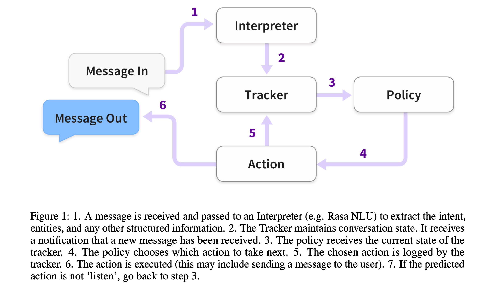

# Rasa: Open Source Language Understanding and Dialogue Management [[pdf]](https://arxiv.org/abs/1712.05181)

- Author
  - Tom Bocklisch, Joey Faulkner, Nick Pawlowski, and Alan Nichol
  - Rasa
- Title of Conference(Journal)
  - arXiv 2017
  - NIPS 2017 Conversational AI Workshop

## Abstract

* 대화 시스템을 만들기 위한 오픈소스 python library인 Rasa NLU와 Rasa Core를 소개함
* 소프트웨어 개발자 없이도 누구나 쉽게 머신러닝 기반 dialogue manager와 language understanding 모듈을 만들 수 있도록 디자인함
* 코드는 깃헙 참고 https://github.com/RasaHQ/

## 1. Introduction

* Rasa NLU와 Rasa Core (dialogue manager)를 개발
* 비전문가도 널리 쓸 수 있음
* Rasa는 이미 전세계의 수천명의 개발자가 사용하고 있음

## 2. Related Work

* Rasa는 몇몇 소스로부터 영감을 받음: Scikit-learn, Keras
* fastText, CloVe 들을 사용
* 

## 3. Description of the Code

* Rasa의 아키텍쳐는 모듈로 디자인되어있어서 쉽게 다른 시스템과 통합할 수 있음
* Python으로 구현되어있고 HTTP API 가능

### 3.1 Architecture

* Dialogue state는 위 Figure 1에서 Tracker 객체에 저장됨
* 대화 세션마다 하나의 Tracker가 존재함
* Tracker는 slot을 저장하고 해당 상태로 연결되어 대화 내에서 발생한 모든 이벤트의 로그를 저장함
* 모든 이벤트를 재생하여 대화 상태를 재구성 할 수 있음
* Figure 1에서 step 1은 Rasa NLU가 담당하고 이외의 모든 step은 Rasa Core가 담당
* Figure 1 설명
  1. Interpreter (Rasa NLU): intent, entity, 기타 정형 데이터(structured information) 추출
  2. Tracker: 대화 상태 유지. 새로운 메세지를 받음
  3. Policy: 현재 상태(state)를 Tracker로부터 받음. 다음 액션을 선택
  4. Action: Policy에 의해 선택된 액션을 수행. 액션에 대한 로그를 Tracker한테 전달

### 3.2 Actions

* DM의 문제를 classification 문제로 풀고자함
* Rasa Core는 미리 정의된 액션 리스트 중에 적절한 액션 하나를 예측함
* 액션은 "유저에게 메세지 보내기" 혹은 "기능(function) 실행하기" 등의 간단한 발화가 될 수 있음
* 액션이 실행될 때, slot, 이전 발화들, 이전 액션들과 같은 대화 히스토리로부터 관련 정보를 사용함
* 액션은 실행할 이벤트를 만들어내고 tracker에게 이를 줌. 이벤트로는 "SlotSet", "AllSlotsReset", "Restarted" 등이 있음 

## 4. Usage

## 5. Demonstration

## 6. Outlook

