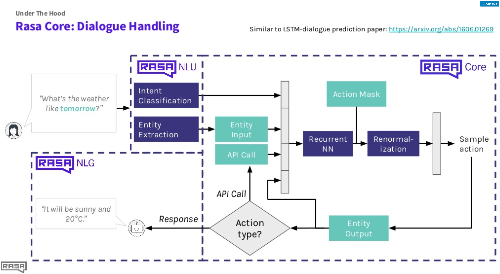
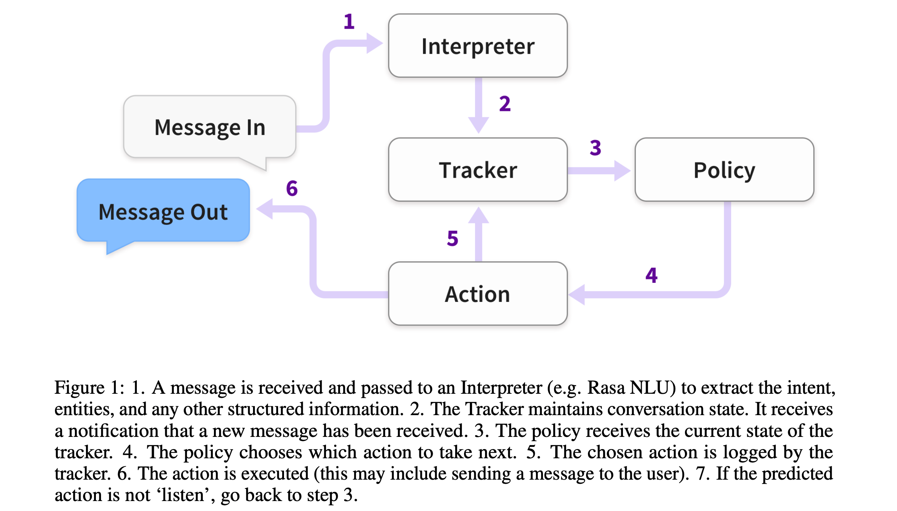

# Rasa: Open Source Language Understanding and Dialogue Management [[pdf]](https://arxiv.org/abs/1712.05181)

- Author
  - Tom Bocklisch, Joey Faulkner, Nick Pawlowski, and Alan Nichol
  - Rasa
- Title of Conference(Journal)
  - arXiv 2017
  - NIPS 2017 Conversational AI Workshop

* Key Points and My Comments
  * 역시 Task-oriented System
  * 논문이라기보단 System Description 느낌
  * 얘네가 추구하는 건 아주 높은 퀄리티보단 누구나 쉽고 편하게 쓸 수 있는 거 같음
  * 따라서 구조나 모듈이 심플하고 나이브함
  * 데이터의 포맷만 잘 맞춰서 준비하면 사용할 수 있음
  * Rasa NLU는 크게 NER과 Intent, 이 결과로 structured data를 얻음 (no vector representation)
    * NER, Intent 둘 다 사용자에 의한 도메인 커스터마이징 가능, 이 경우 해당 모듈을 새로 학습
      * 택시 챗봇을 만들 때, "booking_taxi" 같은 intent를 정의할 수 있음
  * Dialogue Handling(DM)을 옛날처럼 state machine 기반으로 하는 건 더이상 ㄴㄴ. 넘나 복잡함
    * 강화학습(RL)을 하기엔 데이터도 많이 필요하고 policy 정의가 힘듬. 비전문가도 쉽고 편하게 쓰기 위해선 더욱 심플한 구조가 필요
    * state는 다른 Task-oriented 챗봇처럼 slot-value 형태
    * action은 slots, previous utternaces, results of previous action을 기반으로 모델이 결정
    * action은 다시 state에 영향을 줌. action은 "SlotSet", "AllSlotsReset", "Restarted" 등의 "list of event" 형태로 주어짐
  * NLG는 잘 설명이 안되어있는데, 다른 Rasa 자료를 찾아보면 DM(Rasa Core)로부터 structured data를 받고 이를 unstructured text data로 변환하는 작업을 함
    * 기본적으로 Rasa는 built-in templated based NLG로 되어있고, 이 역시 external HTTP server를 붙여서 외부 NLG를 사용한 커스터마이징이 가능
  
  
  
* Reference

  * https://www.youtube.com/watch?v=zpdLFR3sWZ4
  * https://medium.com/@BhashkarKunal/conversational-ai-chatbot-using-rasa-nlu-rasa-core-how-dialogue-handling-with-rasa-core-can-use-331e7024f733
  * https://github.com/RasaHQ/rasa-workshop-pydata-berlin
  * https://www.slideshare.net/JustinaPetraityt/deprecating-the-state-machine-building-conversational-ai-with-the-rasa-stack

## Abstract

* 대화 시스템을 만들기 위한 오픈소스 python library인 Rasa NLU와 Rasa Core를 소개함
* 소프트웨어 개발자 없이도 누구나 쉽게 머신러닝 기반 dialogue manager와 language understanding 모듈을 만들 수 있도록 디자인함
* 생각보다 기술적으로 엄청난 것 같지는 않음. 각 모듈의 수준도 그리 높지 않고 정교하다고 느껴지지도 않음.
* **딱 목적(비전문가도 쉽게 만들 수 있게 하자)에 알맞게 디자인된 Task-oriented 챗봇 프레임워크인 것으로 보임**
* 코드는 깃헙 참고 https://github.com/RasaHQ/

## 1. Introduction

* Rasa NLU와 Rasa Core (dialogue manager)를 개발
* 비전문가도 널리 쓸 수 있음
* Rasa는 이미 전세계의 수천명의 개발자가 사용하고 있음

## 2. Related Work

* Rasa는 몇몇 소스로부터 영감을 받음: Scikit-learn, Keras
* fastText, CloVe 들을 사용

## 3. Description of the Code

* Rasa의 아키텍쳐는 모듈로 디자인되어있어서 쉽게 다른 시스템과 통합할 수 있음
* Python으로 구현되어있고 HTTP API 가능

### 3.1 Architecture

* Dialogue state는 위 Figure 1에서 Tracker 객체에 저장됨
* 대화 세션마다 하나의 Tracker가 존재함
* Tracker는 slot을 저장하고 해당 상태로 연결되어 대화 내에서 발생한 모든 이벤트의 로그를 저장함
* 모든 이벤트를 재생하여 대화 상태를 재구성 할 수 있음
* Figure 1에서 step 1은 Rasa NLU가 담당하고 이외의 모든 step은 Rasa Core가 담당
* Figure 1 설명
  1. Interpreter (Rasa NLU): intent, entity, 기타 정형 데이터(structured information) 추출
  2. Tracker: 대화 상태 유지. 새로운 메세지를 받음
  3. Policy: 현재 상태(state)를 Tracker로부터 받음. 다음 액션을 선택
  4. Action: Policy에 의해 선택된 액션을 수행. 액션에 대한 로그를 Tracker한테 전달

### 3.2 Actions

* DM의 문제를 classification 문제로 풀고자함
* Rasa Core는 미리 정의된 액션 리스트 중에 적절한 액션 하나를 예측함
* 액션은 "유저에게 메세지 보내기" 혹은 "기능(function) 실행하기" 등의 간단한 발화가 될 수 있음
* 액션이 실행될 때, slot, 이전 발화들, 이전 액션들과 같은 대화 히스토리로부터 관련 정보를 사용함
* 액션은 실행할 이벤트를 만들어내고 tracker에게 이를 줌. 이벤트로는 "SlotSet", "AllSlotsReset", "Restarted" 등이 있음 

### 3.3 Natural Language Understanding

* Rasa NLU 모듈에 대한 것
* 커스터마이징과 쉬운 사용, 두 마리 토끼를 잡기 위해 대부분의 use case에서 잘 작동하는 pre-defined 파이프라인을 제공
* 예를 들어, "spacy_sklearn" 파이프라인은 다음의 과정을 통해 텍스트를 처리함
  * spaCy를 이용해서 텍스트 토크나이징과 POS 처리
  * GloVe 써서 각 토큰 임베딩 룩업하고 최종 representation을 만듬
  * 그리고 sklearn을 통해서 svm 학습
* 그리고 "ner_crf" 컴포넌트도 토크나이징 + POS

### 3.4 Policies

* tracker가 준 정보를 기반으로 다음에 실행할 액션을 선택하는 역할
* 여기에는 featurizer라는 게 있는데, 이게 현재 대화 상태에 대한 vector representation을 만들어줌
* featurizer는 다음을 표현하는 feature를 concat함
  * 직전 액션이 무엇이었나
  * 가장 최근 유저 메세지의 인텐트와 엔티티
  * 어떤 슬롯이 현재 정의되어 있는가 (value를 찾은 슬롯을 의미하는 듯)

## 4. Usage

### 4.1 Training Data Formats

* Rasa NLU: json, md 포맷 지원

  

  * NLU는 하나의 문장, 인텐트, 엔티티(list)로 구성된 샘플로 학습

* Rasa Core (DM): md 포맷 지원

  

  * 위와 같은 dialogue 형태
  * 제일 윗줄은 대화의 hash code
  * 바디 부분은 sequence of 이벤트
    * 여기서 이벤트라 하면 inform{"location": "rome"...} 같은 거
    * inform은 dialogue act라 보면 됨
  * 시스템의 액션 또한 이벤트이며, 위에서 dash(-)가 붙은 라인이 이에 해당됨

### 4.2 Machine Teaching

* Rasa Core는 supervised learning과 함께 machine teaching이라는 걸 지원

* machine teaching이란 개발자가 시스템이 만든 액션을 고치는 거임

* 이건 학습 데이터 생성과 그럴듯한 대화의 공간을 탐색하기 위한 practical한 어프로치

  

* 위와 같은 프롬프트를 유저가 보고 처리함
* 봇의 액션, 유저의 발화 및 인텐트를 보고 봇이 선택한 액션이 적절한지 평가하는 것임
* 위의 보기 중 2번을 유저가 선택했다면, 다른 액션들이 봇의 예측 확률과 함께 주어지고 이중 뭐가 적절한지 골라야 함
* 위와 같이 데이터를 생성하고 이를 학습한다는 거 같음

## 5. Demonstration

* Rasa Core의 유용함을 보이기 위해, bAbI 데이터셋을 사용
* 간단한 slot filling 문제
* 같은 정보(slot value)를 얻어내기 위한 방법은 여러가지가 있기 때문에 non-linearity를 내제한 문제라고 볼 수 있음
* 그래서 accuracy나 precision는 dialogue policy를 평가하기에 적절한 metric이 아닐 수 있음
* 실험을 해보면 이미 slot value를 얻은 것에 대해서는 시스템이 해당 정보를 얻기 위한 질문(액션)을 하지 않음 (확률이 낮게 책정됨)

## 6. Outlook

* Rasa NLU and Core 짱짱
* 많은 contribution 바람

