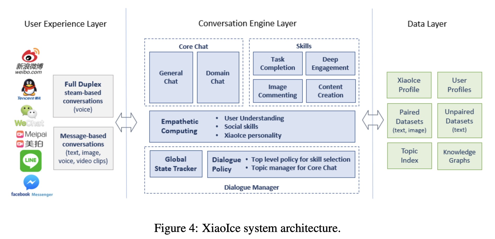
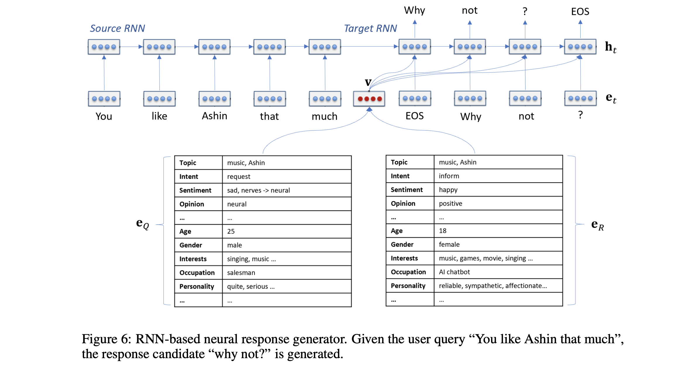
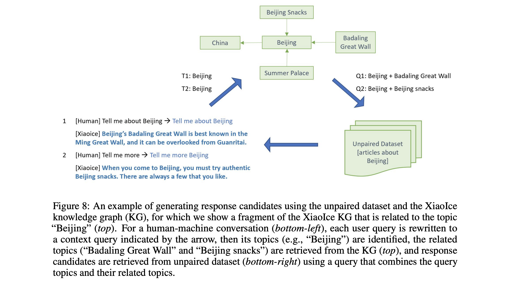
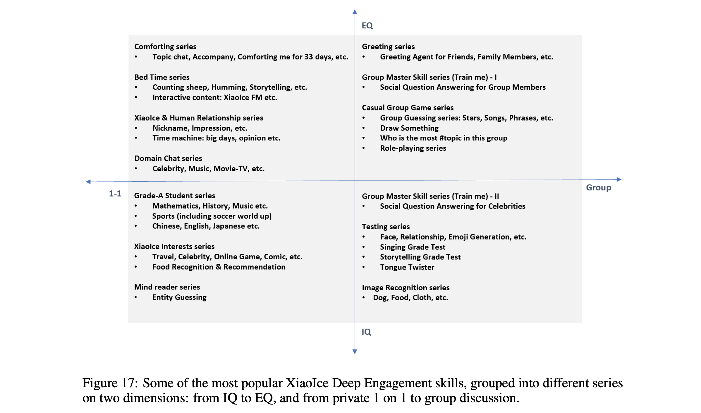
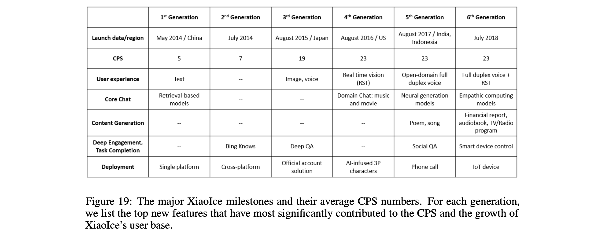

# The Design and Implementation of XiaoIce, an Empathetic Social Chatbot [[pdf]](https://arxiv.org/abs/1812.08989)

- Author
  - Li Zhou, Jianfeng Gao, Di Li, and Heung-Yeung Shum
  - MS & MS Research
- Title of Conference(Journal)
  - arXiv 2018

## Abstract

* XiaoIce 시스템 개발에 대한 description
* Intelligent Quotient (IQ)와 Emotional Quotient (EQ), 두 가지를 모두 고려
* Key components of the system architecture:
  1. Dialogue Manager
  2. Core Chat
  3. Dialogue Skills
  4. Empathetic Computing Module

* CPS = 23

## 1. Introduction

* Eliza, Parry, ALice 등의 초기 대화 시스템은 Turing Test를 통과하기 위해 텍스트 기반으로 사람을 흉내내도록 디자인됨
* 꽤 괜찮은 결과를 보여줬으나, hand-crafted rules에 기반하고 특정 대화 환경에서만 잘 작동한다는 한계가 있음
* 최근에는 많은 양의 대화 데이터와 머신러닝의 혁신을 통해 학계와 산업에서 유망한 결과들이 나오고 있음
* 이 논문에서 Microsoft의 소셜 챗봇인 **XiaoIce의 디자인과 구현에 대해서 소개할 것**임
* XiaoIce는 5개국(중국, 일본, 미국, 인도, 인도네시아; 일본에서는 Rinna)에서 40개 이상의 플랫폼(위챗, 큐큐, 웨이보, 페메, 라인)을 통해 서비스 중임
* XiaoIce는 Open-domain 챗봇으로서 사람과 장기적 관계를 형성할 수 있다는 점에서 Siri, Alexa, Google Assistant 등과 차별점을 보임
* *Figure 1에서 XiaoIce와 사람이 약 2달간 관계를 형성하고 발전시켜나가는 예시는 정말 신기하고 놀라움*

## 2. Design Principle

* 소셜 챗봇은 특정 테스크를 잘 처리하기 위한 IQ 역량 뿐 아니라, 사람의 감정에 대응할 수 있는 EQ 역량도 매우 중요함
* IQ와 EQ를 통합시키는 게 XiaoIce의 핵심 시스템 디자인임
* XiaoIce는 자체의 유니크한 personality를 갖고 있음

### 2.1 IQ + EQ + Personality

* **IQ**
  * IQ 역량은 다음을 포함함: 1) 지식과 기억의 모델링, 2) 이미지와 자연어의 이해, 3) 추론, 4) 생성, 5) 예측
  * 이것들은 Dialogue Skills 개발에 있어서 기초가 되고 소셜 챗봇으로서 사람들의 니즈 충족과 테스크 해결을 위해 필수적임
  * 지난 5년간 XiaoIce는 질의응답, 추천 등에 대한 230개의 Dialogue Skills을 개발함
  * 가장 중요한 Skill은 사람과 많은 주제에 대해서 오래 넓게 대화할 수 있게 해주는 "Core Chat"이라는 것임 (뒤에서 다룰 것)
* **EQ**
  * Empathy와 Social Skills, 크게 2가지 컴포넌트가 있음
  * Empathy
    * 다른 사람의 경험에 대해 이해하고 공감하는 역량 (역지사지)
    * 대화로부터 유저의 감정을 알아내고, 시간에 따라 어떻게 변하는지 감지하고, 유저의 감정적 니즈를 이해하는 것은 소셜 챗봇에게 꼭 있어야 할 능력임
    * 이를 위해서는 다음의 문제를 해결해야 함: 1) query understanding, 2) user profiling, 3) emotion detection, 4) sentiment recognition, 5) dynamically mood tracking
  * Social Skills
    * 유저는 다양한 배경과 관심사를 갖고 있기 때문에 소셜 챗봇은 personalize된 응답을 해야 함
    * 이때의 응답은 감정적으로도 적절해야 하며, 유저의 관심사에도 알맞아야 함
  * Figure 2는 XiaoIce의 EQ 역량을 잘 보여줌. 사회적으로 적절한 답(유머, 위로)을 할 뿐만 아니라, 할 얘기가 없을 때 새로운 주제로 이끌어 나가기도 함
* **Personality**
  * 행동, 인지, 감정 패턴 등의 집합으로 정의됨
  * 소셜 챗봇은 일관된 personality를 보여줘야 유저와 오랜 신뢰 관계를 형성할 수 있음
  * XiaoIce의 페르소나는 reliable하고 sympathetic하고 affectionate하고 sense of humor를 갖춘 18살 여자아이로 디자인함

### 2.2 Social Chatbot Metric: CPS

* 주로 Turing Test로 칫챗 성능을 평가하는데, 이는 얼마나 오랫동안 대화하는지 감정적으로 교류하는지 알 수 없음
* 그래서 우리는 Conversation-turns Per Session (CPS)라는 것을 소셜 챗봇의 평가 지표로 정의함

### 2.3 Social Chat as Hierarchical Decision-Making

* 위의 디자인 목표를 달성하기위해, 우리는 소셜 챗봇 문제를 Decision-Making Process로 바라봄
* Decision-Making Process를 계층적으로 함
  * top-level process
    * 전체적인 대화를 관리하고 대화 모드의 타입 별 Skill의 선택에 대한 decision
    * ex) chatting casually, question answering, ticket booking
  * low-level process
    * 선택한 스킬을 컨트롤하고, 대화 생성이나 테스크 해결을 위한 액션 선택에 대한 decision
* 이런 Decision-Making Process는 수학적으로 Markov Decision Process (MDP)로 볼 수 있음
* 소셜 챗봇은 사람과 interacting하는 환경에 놓인 것이며, 이런 환경에서 탐색을 함
* 각 턴에 대해서 현재 대화 상태(state), 선택할 수 있는 스킬(option) 혹은 대답(primary action)을 Hierarchical Dialogue Policy에 따라서 선택하고 새로운 state를 탐색하게 되는 것. 마치 MDP처럼
* 또한 새로운 state에 대해서 유저의 반응이라는 보상(reward)을 받게 됨. 대화가 종료될 때까지 이런 싸이클을 도는 것임
* XiaoIce는 Dialogue Manager가 이런 각 턴에 따른 dialogue state tracking과 policy에 따른 response 선택 등을 담당함
* XiaoIce는 CPS를 늘리기위해, 위와 같이 반복적으로 trial-and-error를 반복함. 그리고 항상 exploration과 exploitation의 tradeoff에 대한 밸런스를 잘 맞추려고 함
  * exploit란 이미 알고 있는 것을 잘 활용하는 것
  * explore란 기존 유저는 더 깊게 관계를 맺고 새로운 유저는 끌어들일 수 있게 모르는 것(new skills and dialogue policies)에 대해서 시도해보는 것

##3. System Architecture

* **User Experience Layer**
  * WeChat 같은 플랫폼과 연결되는 부분이며, 2가지 모드가 존재함
    * Full-Duplex
      * 음성 기반 대화, 전화하듯이 서로 동시에 대화하는 것
    * Taking turns
      * 메세지 기반 대화, 채팅하듯이 서로 주고 받으며 대화하는 것
  * 음성 인식, 음성 합성, 이미지 이해, 텍스트 정규화 등의 컴포넌트가 있음
* **Conversation Engine Layer**
  * 아래의 4가지 모듈로 구성됨. Chapter 4에서 자세히 다룸
    * Dialogue Manager
      * Dialogue State를 tracking하고 (Dialogue State Tracker)
      * Core Chat 또는 Dialogue Skill 중에 어떤 걸 선택할지 dialogue policy를 사용해서 정함
    * Empathetic Computing Module
      * 내용적인 측면의 이해: topic
      * 감정적인 측면의 이해: emotion, intent, opinion on topic, user's background & general interests
      * XiaoIce의 EQ를 담당, IQ는 Core Chat과 Skills
    * Core Chat
    * Dialogue Skills
* **Data Layer**
  * 여러 데이터 베이스로 구성됨
    * Conversational Data (text-text pair, text-image pair)
    * Non-conversational Data (text)
    * Knowledge Graph for Core Chat and Skills
    * XiaoIce Profile
    * All Registered User Profiles

## 4. Implementation of Conversation Engine

### 4.1 Dialogue Manager

1. **Global State Tracker**: 현재 대화의 상태 $s$ 를 트레킹하는 역할
   * working memory를 통해 관리함
   * **세션의 시작에는 memory를 비운 상태, 대화 진행에 따라 각 턴 별로 유저의 발화와 XiaoIce의 대답을 memory에 저장해나감. 이때 text에서 Empathetic Computing Module(Section 4.2에서 소개)이 추출한 entity와 empathy label도 함께 저장함**
   * working memory에 있는 정보는 dialogue state vector $s$ 로 인코딩됨

2. **Dialogue Policy**: policy 함수 $\pi$ 를 기반으로 현재 대화 상태 $s$ 에서 취할 액션 $a$ 를 정함
   * Section 2.3에서도 설명한 것처럼 XiaoIce는 heirarchical policy를 사용하고 있음
     * Top-level policy: 각 턴에서 Core Chat과 Skill을 dialogue state에 따라 선택하므로서 전체적인 대화를 관리
     * Set of Low-level policies: 각 스킬 별로 policy가 있음
   * XiaoIce는 유저의 피드백을 기반으로 trial-and-error process를 다음과 같이 반복적으로 돔
     * if 유저의 인풋 == text
       * Core Chat가 처리
       * Topic Manager (Section 4.1.3에서 소개)은 1) 새로운 토픽으로 전환할지 혹은 2) 유저의 흥미가 감지되었을 때 General Chat에서 특정 Domain Chat으로 전환할지를 결정하므로서 Core Chat을 관리함 (뒤에 소개하겠지만, Core Chat은 General Chat과 Domain Chat으로 구성)
     * else if 유저의 인풋 == image or video
       * Image Commenting Skill이 처리
     * Skills of Task Completion, Deep Engagement, and Content Creation
       * 특정 유저 인풋과 대화 문맥에서 작동함
       * 예를 들어, 
         * 음식 사진이 들어오면 Food Recognition과 Recommendation Skill이 활성화됨
         * 매우 부정적인 감정(sentiments)가 감지되면 Comforting Skill이 활성화됨
         * "XiaoIce, what is the weather today"와 같은 특수한 명령이 들어오면 Weather Skill이 활성화됨
         * 만약에 여러 Skill이 동시에 발동될 경우, confidence score, pre-defined priority, session context를 기반으로 여러 개 중에서 선택함
         * 스무스한 대화 진행을 위해서 잦은 Skill의 전환은 피함. 새로운 Skill이 활성화될 때까지 현재 Skill을 계속 돌림

3. **Topic Manage**: 

   * 1) 각 턴에서 토픽를 전환할지 결정하는 Classifier과 2) 새로운 토픽 추천을 위한 Topic Retrieval Engine으로 구성됨
   * 토픽 전환(switching)은 토픽에 대한 충분한 지식이 없거나 유저가 지루해 할 때 발동되며, 보통 다음과 같은 상황임
     * Core Chat이 적절한 응답을 생성해내지 못했을 때, editorial response (Section 4.3에서 다룸) 를 사용함
     * 생성된 응답 발화가 유저 인풋을 단순히 따라하거나 별 정보가 없는 경우
     * 유저 인풋이 별 게 없을 때 (ex. "OK", "I see", "go on")

   * 토픽 데이터셋은 인스타그램이나 중국의 douban.com 같이 양질의 인터넷 포럼에서 유명한 토픽과 관련 코멘트 및 디스커션을 수집함
   * 토픽 전환 트리거가 발동하면 현재 대화 상태를 쿼리로 사용하여 후보 토픽에 대한 탐색을 진행함. 머신러닝 기반 boosted tree ranker에 의해서 새로운 토픽이 선택됨. 해당 모델은 다음의 피처를 사용함
     * Contextual relevance: 얼마나 현재 대화 문맥과 관련이 있고, 아직 얘기하지 않은 새로운 토픽인가
     * Freshness: 시간을 고려하였을 때, 해당 토픽이 얼마나 신선하고 유효한가. 특히 뉴스
     * Personal interests: 유저 프로파일과 해당 토픽이 얼마나 유사한가
     * Popularity: 인터넷이나 XiaoIce 유저들 사이에서 해당 토픽이 얼마나 주목 받는 토픽인가
     * Acceptance rate: XiaoIce 유저들이 그동안 해당 토픽을 얼마나 accept했는가

### 4.2 Empathetic Computing

* Empathetic Computing은 XiaoIce의 EQ를 담당하며 감정적인 측면을 모델링함. 모델링 루틴은 다음과 같음
  1. 유저의 인풋 query $Q$ 가 들어옴
  2. 대화의 문맥 $C$ 를 고려해서 $Q$ 를 $Q_C$ 로 만듬(rewrite)
  3. 대화 상에서 유저의 감정과 상태(state)를 query empathy vector $\bold{e}_Q$ 로 인코딩함
  4. 대답 $R$ 의 감적적인 측면을 구체화해서 response empathy vector $\bold{e}_R$ 을 만듬
* **최종적으로 Empathetic Computing의 아웃풋 dialogue state vector $s=(Q_C, C, \bold{e}_Q, \bold{e}_R)$ 로 표현함**
* 이는 Skill 선택을 위한 Dialogue Policy와 interpersonal response 생성을 위한 Core Chat 등에 인풋으로 주어짐
* Empathetic Computing Module은 다음의 3가지 컴포넌트로 구성됨
  * **Contextual Query Understanding (CQU)**
    * CQU는 $Q$ 를 대화의 문맥 정보 $C$ 를 고려하여 $Q_C$ 로 바꿔주는 역할을 함. 위의 모델링 루틴에서 2번에 해당. 바꾸는 방법은 다음과 같음
      * Named Entity Identification: $Q$ 에 언급된 모든 entity를 레이블링하고 state tracker의 working memory에 저장된 entity와 연결(link)함. 새로운 entity는 working memory에 저장함
      * Co-reference Resolution: 모든 대명사를 그에 해당하는 entity name으로 대체함
      * Sentence Completion: $Q$ 가 완전하지 않은 문장일 때, 문맥 $C$ 를 이용해서 문장을 완성함
    * Figure 5에서 대명사 "him"을 "Ashin", "that"을 "The Time Machine"으로 치환한 부분 등을 참고하면 위의 방법을 더 잘 이해할 수 있음                  
    * 이렇게 만든 contextual query $Q_C$ 는 Core Chat에서 답변을 생성하는데 사용함 (Section 4.3에서 소개)
  * **User Understanding**
    * CQU를 통해 구한 $Q_C$ 와 문맥 $C$ 를 기반으로 query empathy vector $\bold{e}_Q$ 를 만드는 컴포넌트. 위 루틴에서 3번에 해당함
    * $\bold{e}_Q$ 는 Figure 5 (b)와 (c) 같이 유저의 intent, emotion, topic, opinion, persona 등을 표현하는 key-value 쌍의 리스트로 구성됨
    * 이 key-value 쌍들은 다음의 머신러닝 classifier를 사용해서 만들어냄
      * Topic Detection: 유저가 같은 토픽을 이어가는지, 또는 새로운 토픽을 꺼내는지 레이블링
      * Intent Detection: $Q_C$ 가 어떤 Dialogue Act를 사용하는지 (e.g., greet, request, inform, etc.)
      * Sentiment Analysis: 유저의 감정 (e.g., happy, sad, angry, neutral) 과 대화 중에 어떻게 감정이 변하는지 (e.g., from happy to sad)
      * Opinion Detection: 토픽에 대한 유저의 리액션이 어떤지 (e.g., positive, negative, neutral)
      * 만약 유저의 ID를 알고 있다면, 유저의 프로파일 (성별, 나이, 관심사, 직업, 성격 등)에 따라서 유저의 페르소나를 $\bold{e}_Q$ 에 포함시킴
  * **Interpersonal Response Generation**
    * 이 컴포넌트는 response empathy vector $\bold{e}_R$ 을 생성함. 이 벡터는 생성될 response의 감정적 양상과 XiaoIce의 페르소나를 나타냄
    * 여러 휴리스틱을 사용해서 $\bold{e}_Q$ 를 기반으로 $\bold{e}_R$ 을 만들어냄
    * 또한 페르소나 같은 경우 XiaoIce에 맞춰서 미리 정의된 프로파일을 사용함
    * $\bold{e}_Q$ 와 $\bold{e}_R$ 으로 어떻게 답변을 생성해내는지는 다음 섹션에서 소개함

### 4.3 Core Chat

* Core Chat은 XiaoIce에서 매우 중요한 컴포넌트임. Empathetic Computing과 마찬가지로 텍스트 인풋을 받아서 interpersonal한 답변을 아웃풋으로 생성함

* Core Chat은 크게 General Chat과 Domain Chat 파트로 나뉨
  * General Chat: Open-domain 대화를 위해 넓은 범위의 토픽을 커버함
  * Domain Chat: 더 깊은 대화를 위해 구체적인 도메인(음악, 영화, 셀럽)을 다룸
  
* General Chat과 Domain Chat은 데이터셋은 달라도 둘다 같은 엔진(모델?)을 사용하고 있기 때문에, 아래에서 General Chat에 대해서만 자세히 다룸

* General Chat은 data-drive response generation system임

* 인풋으로 dialogue state $s=(Q_C, C, \bold{e}_Q, \bold{e}_R)$ 를 받아서, 1) 후보 답변을 만들고 2) 랭킹을 매겨서 최종 response $R$ 을 아웃풋으로 내놓음

* 1) 후보 답변은 대화나 텍스트로 구축된 데이터베이스를 탐색(retrieve)하거나, neural generative model을 통해 생성해냄. 구체적으로 아래의 3가지 Generator를 사용해서 후보 답변을 만들어냄

  * **Retrieval-Based Generator using Paired Data**

    * Paired 데이터셋은 query-response 쌍으로 이루어져 있음. 데이터는 아래의 2가지 방법을 통해 수집함

      * SNS, 포럼, 뉴스 코멘트 등의 인터넷에서 사람들 간의 대화를 수집

      * 2014년 XiaoIce 출시 후에 발생한 사람-머신 간의 대화를 2018년까지 30B개 이상 수집.  현재 XiaoIce 답변 중 70%는 과거에 XiaoIce와 사람 간의 대화에서 탐색(retrieve)해서 사용

    * 데이터셋(특히 인터넷에서 가져온 데이터)의 질을 컨트롤하기 위해서, Empathetic Computing Module을 사용하여 각 query-response 쌍을 튜플 $(Q_C, R, \bold{e}_Q, \bold{e}_R)$ 으로 변환함

    * 이 튜플에 대해서 XiaoIce 페르소나에 맞는 Empathetic response만 살리도록 필터링함

    * 또한 개인 정보, 더러운 콛, 부적절한 컨텐츠, 스펠링 미스 등이 있는 쌍들 역시 제거함

    * 필터링된 페어들은 효율적인 검색을 위해 Lucene을 사용해서 인덱싱함

    * 실제로는 인풋 query $Q_C$ (in the state $s$) 를 사용해서 paired dataset에 대해 머신러닝 representation 기반으로 키워드 및 의미 검색을 하고 최종적으로 최대 400개의 후보 대답을 추림

    * 데이터셋에 대한 검색 결과(후보 대답)의 질은 우수하지만, 데이터셋에 존재하지 않는 새로운 혹은 적게 나타나는 토픽에 대해서는 낮은 커버리지를 보임

    * 이런 커버리지를 높이기 위해, 아래에서 소개할 Neural Response Generator를 사용

  * **Neural Response Generator**

    * Retrieval-based Generator와 달리, 어떤 토픽에 대해서도, 심지어는 사람 간 대화 데이터에서 못 본 것이어도 학습을 통해서 대답을 생성해낼 수 있음. Paired 데이터셋을 통해서 학습함
    * Neural-based Generator는 robust하고 높은 커버리지를 보이는 반면, Retrieval-based Generator는 유명한 토픽에 대해 양질의 답을 만들 수 있음. 따라서 서로 상호 보완적으로 역할을 함
    * 현재 많은 연구가 진행 중이고, 결국 소셜 챗봇의 퍼포먼스 향상에 있어서 매우 중요한 역할을 할 것임
    * **XiaoIce의 Neural Response Generator는 seq2seq를 기반으로 하고 있음**
    * seq2seq 모델이 돌아가는 매커니즘은 다음과 같음 (Figure 6 참고)
      1. 유저의 인풋 query $Q_C$ 를 Source RNN(Encoder)에 태움
      2. user의 query와 XiaoIce의 response에 대한 empathy vector인 $\bold{e}_Q$ 와 $\bold{e}_R$ 를 하나로 합쳐서 interative representation $\bold{v}=\sigma{(\bold{W}_Q^T \bold{e}_Q + \bold{W}_R^T \bold{e}_R)}$ 를 만듬
      3. Source RNN의 아웃풋인 context vector와 interative representation을 통해서 Target RNN(Decoder)으로 response $R$ 을 한 단어씩 생성해냄
    * 최종적으로 Beam Search를 사용해서 최대 20개의 후보를 생성함
    * Empathy 정보를 활용하여 생성을 하기 때문에 일관된 답변을 생성할 수 있음. Figure 7에서 grounding을 안한 건 나이를 물어볼 때 매번 달라지지만, 한 건 일관되게 답을 함

  * **Retrieval-Based Generator using Unpaired Data**

    * 위의 두 Generator에서 사용하는 Piared 대화 데이터 외에도 훨씬 더 고품질의 많은 양의 텍스트 데이터(unpaired & non-conversational)가 있음
    * XiaoIce에 사용한 unpaired 데이터셋은 공개 강의나 뉴스/리포트의 인용구로부터 수집한 문장들로 구성되어 있음
    * 해당 문장들의 발화자가 누구인지 알 수 있기 때문에 앞선 두 Generator에 사용하는 $\bold{e}_R$ 을 계산할 수 있기에 충분히 이 문장들도 후보 대답 $R$ 로 동일하게 다룰 수 있음
    * 데이터 필터링 파이프라인 역시 $(R, \bold{e}_R)$ 에 대해서 paired 데이터와 유사하게 적용함 (paired는 query에 대한 정보도 튜플에 포함됨)
    * Paired 데이터처럼 Unpaired 데이터도 Lucene을 사용해서 인덱싱을 함. 하지만 Paired와 달리 런타임에 $Q_C$ 에 대해서 토픽을 추가하는 등의 query 확장을 진행함

    

    * 이 query 확장을 위해 Knowledge Graph (KG)를 사용함. KG는 MS의 Satori라는 것을 사용하며, head-relation-tail의 triplet (h, r, t) 으로 이루어져 있음
    * 위의 Figure 8은 XiaoIce KG와 unpaired 데이터셋을 이용해서 후보 답변을 생성하는 과정을 나타내고 있음. 이 과정을 3단계로 설명하면 다음과 같음
      1. 유저의 query $Q_C$ 로부터 토픽을 뽑아냄. (e.g., "tell me about Beijing"에서 "Beijing"이라는 토픽을 뽑음)
      2. KG로부터 위에서 뽑은 토픽과 가장 관련있는 최대 20개의 토픽을 뽑음 (e.g., "Beijing"과 관련이 큰 "Badaling Great Wall"과 "Beijing snacks"를 뽑음). 이렇게 뽑은 토픽들은 사람이 직접 레이블링한 학습데이터를 통해 학습된 boosted tree ranker를 사용해서 관련도 순으로 정렬함
      3. $Q_C$ 의 토픽과 KG의 토픽을 합해서 새로운 query를 만듬. 이 query를 이용해서 unpaired 데이터셋에 대해 최대 400개의 후보 답변 문장을 탐색(retrieve)하여 추출함
    * 비록 unpaired 데이터셋으로부터 뽑은 후보 답변의 질은 paired에 비해 떨어질 수 있지만, 훨씬 더 넓은 범위의 토픽을 커버할 수 있음
    * Neural Generator와 비교해서는 unpaired가 더 길고 좋은 컨텐츠를 포함하고 있음

* 2) 후보 답변에 대한 랭킹은 아래의 1가지 방법을 사용

  * **Response Candidate Ranker**
    * 위의 3가지 방법을 통해 얻은 후보 답변들에 대해서 boosted tree ranker를 이용해서 랭킹을 매김
    * 최종 답변은 thresholde 이상의 상위 랭킹 스코어를 받은 후보 답변들 중 하나를 랜덤하게 선택함
    * Ranker 모델은 주어진 dialogue state $s=(Q_C, C, \bold{e}_Q, \bold{e}_R)$ 와 각각의 후보 답변 $R^{`}$ 에 대해 다음의 feature 4개를 기반으로 랭킹 스코어를 계산함
      * Local cohesion features:  $Q_C$ 와 $R^{`}$ 의 유사도. 좋은 답변은 query와 의미적으로 관련이 있어야 함
      * Globl coherence features: $(Q_C, C)$ 와 $R^{`}$ 의 유사도. 좋은 답변은 query와 context에 대해서 의미적으로 일관되어야 함
      * Empathy matching features:  $\bold{e}_{R}$ 와 $\bold{e}_{R^{`}}$ 의 유사도. 좋은 답변은 XiaoIce의 페르소나에 맞는 Empathetic Response여야 함
      * Retrieval matching features: 탐색 결과로 얻은 query-response 쌍에서의 query와 $Q_C$ 간의 유사도. word level (BM25, TFIDF)와 semantic level (문장 유사도)를 이용함
    * Ranker는 dialogue-state-response 쌍인 $(s, R)$ 에 대한 3-level 스케일을 갖는 레이블(rating)을 이용해서 학습을 함. Figure 9와 같은 데이터 모양임
      * 0: the response is not empathetic or not very relevant to the query. It is likely to lead to the termination of the conversation.
      * 1: the response is acceptable and relevant to the query. It is likely to help keep the conversation going.
      * 2: this is an empathetic, interpersonal response that makes users feel delightful and excited. It is likely to drive the conversation.

* **Editorial Response**

  * pass

### 4.4 Dialogue Skills

* 230개의 Dialogue Skills이 있음. 이를 4개의 카테고리에 대해서 간략이 설명: 1) image commenting, 2) content creation, 3) deep engagement, 4) task completion

* **Image Commenting**

  * 소셜 채팅에서 이미지의 역할이 매우 커지고 있음
  * 물체 인식 + 이미지 설명 뿐 아니라, 페르소나, 태도, 위치를 반영한 감정적 코멘트까지 만들어냄. 이런 점에서 전통적인 비전 테스크와는 또다른 문제라고 할 수 있음. Figure 11에 어떻게 다른지 예시를 들어놓음
  * 모델의 구조는 Core Chat과 유사함. 다만 인풋으로 이미지나 영상을 받는 것

* **Content Creation**

  * *재미있는 놀이 컨텐츠 같은 건가? 감이 잘 안옴*

* **Deep Engagement**

  * Deep Engagement Skill이란 유저의 특정 감정이나 지적 니즈를 만족시키기 위해 특정 토픽이나 세팅에 타겟하는 것. 이를 통해 유저와 장지적 관계를 맺어나감

    

  * 이 카테고리에 포함된 스킬들은 크게 2가지 차원에 대해서 그룹핑을 할 수 있음: (IQ-EQ)와 (1대1-Group). Figure 17 참고

  * (IQ-EQ) 축은 XiaoIce의 관심사, 경험, 지식 등과 관련된 구체적인 토픽에 대해서 얘기를 풀어나가는 것 또는 감정적 위로를 위한 접근을 통해서 사람들의 감정적 니즈를 맞춰주는 것

  * (1대1-Group) 축은 얼마나 프라이빗한 얘기를 나눠볼 것인가 공통적인 얘기를 할 것인가

* **Task Completion**

  * Personal Assistant와 유사하게 날씨, 기기 조작, 노래, 뉴스 등에 대한 테스크를 처리하는 것

    

## 5. XiaoIce in the Wild

* **Core Chat (Conversation Engine)**
  * 5세대부터 neural generator가 도입됨. 이는 XiaoIce의 답변 커버리지와 다양성을 크게 향상시킴.
  * Empathetic Computing Module 역시 큰 역할을 하는데 특히 6세대에 empathy model들을 통합하면서 사람에 대한 XiaoIce의 감정적 커넥션이 강화됨
* **User Experience**
  * 5세대부터 Full Duplex를 지원하면서 더 자연스러운 의사소통을 가능하게 하고 대화 세션의 길이를 크게 증가시킴. 다른 소셜 챗봇이나 어시스턴트와 확실한 차별점
* **New Skills**
  * pass
* **Platform**
  * pass

## 6. Conclusions

* "의미있는 대화와 행복은 함께 간다"
* 앞으로는 소셜 챗봇이 의미있는 대화의 상대가 되어줄 것임
* Future Works
  * **Towards a unified modeling framework**: 지금은 MDP 기반의 계층적 의사결정을 통해 여러 모듈이 작동하는데 이를 하나의 프레임워크로 통일할 필요가 있음
  * **Towards goal-oriented, grounded conversations**: *goa l 개념에 대해 이해 잘 안됨* . 현실 세상의 더 넓은 범위의 대화를 fully grounding해보자
  * **Towards a proactive personal assistant**: XiaoIce는 유저의 관심사와 의도를 더 정확히 인식할 수 있음. 여기서 커머셜 벨류가 발생한다고 생각! 쿠폰 스킬을 추가해서 유저의 니즈가 포착되면 쿠폰을 주는 거임. 유저 피드백 로그 같은 걸 보면 이에 대해서 실제로 해당 추천이 잘 수용되고 있다는 걸 확인함
  * **Towards human-level intelligence**
    * 기술적인 발전
  * **Towards an ethical social chatbot**

