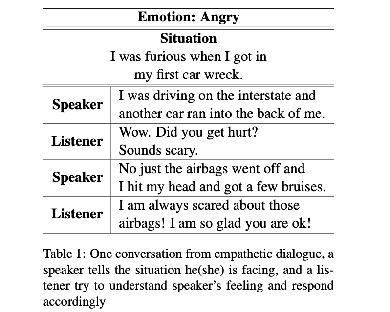
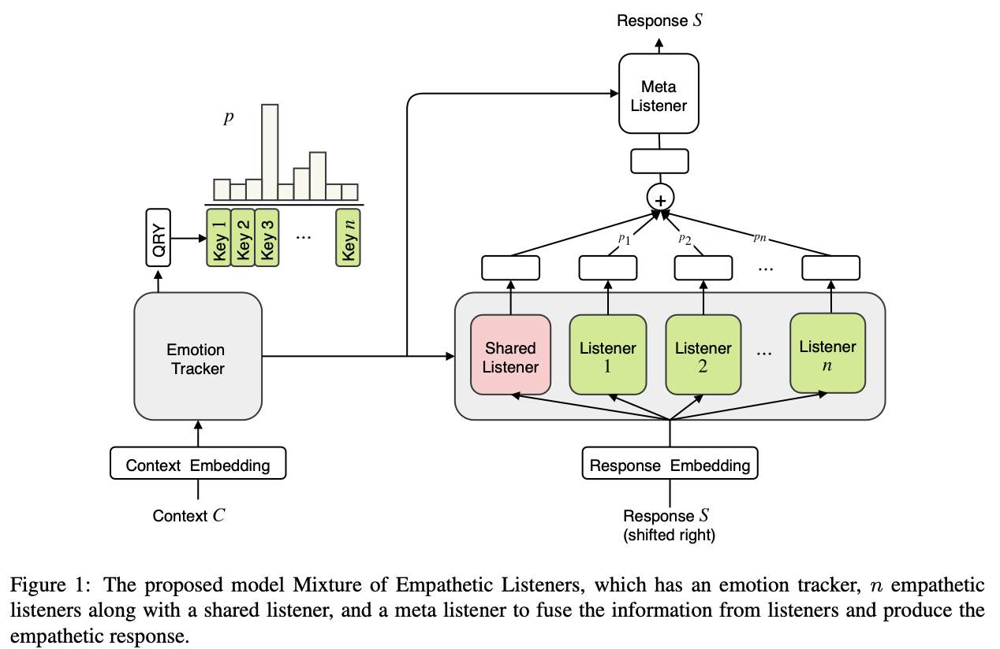

# MoEL: Mixture of Empathetic Listeners [[pdf]](https://www.aclweb.org/anthology/D19-1012/)

- Author
  - Zhaojiang Lin, Andrea Madotto, Jamin Shin, Peng Xu, Pascale Fung 
  - The Hong Kong University of Science and Technology
- Title of Conference(Journal)
  - EMNLP 2019

- Key Points and My Comments
  - 이전 연구는 현재 발화의 감정 상태를 예측하는 것과 decoding 하는 문제를 멀티 태스크로 푸는 방향이 하나가 있고 (EmpatheticDialogue), 고정된 감정을 갖는 발화를 생성하는 방향이 있음 (PersonaChat)
  - 이 두 어프로치는 몇 가지 중요한 포인트를 놓치고 있는데, 1) 어떤 감정으로 대답해야 하는지 implicit하게 학습해서 interpretability의 한계와 generic response 문제가 있음. 또한 2) 조건부로 generation을 할 때 우리는 특정 감정을 인풋으로 주는데, 이때 이런 감정이 적절한 건지 우리도 사실 모른다는 문제점이 있음
  - 

## Abstract

* 이전 empathetic dialogue system 연구들은 주로 주어진 특정 emotion에 대한 generation을 하는 게 메인이었음
* 그러나 empathy는 generation도 필요하지만 understanding 쪽도 중요함. 이런 이해를 바탕으로 적절한 감정의 발화를 생성해야 함
* 그래서 우리는 empathy를 모델링하는 e2e novel approach인 MoEL을 제안함
* 우리 모델은 먼저 유저의 감정을 포착하고 감정에 대한 분포를 내놓음. 그럼 이걸 기반으로 MoEL은 여러 감정 별 Listener의 output state를 soft하게 조합해서 적절한 empathetic response를 내놓음. 각 Listener는 담당하고 있는 감정에 특화되어 있음
* Empathetic dialogues (Rashkin et al., 2018)의 human evaluation을 했을 때 SOTA
* 각각 generated response를 보면 interpretable함

## 1. Introduction

* 대화를 위한 neural approach들이 꽤 잘 됨. 다만, MLE를 기반으로 하기에 일반적이고 반복적인 말들이 나옴
* Commonsense의 이해와 일관된 페르소나 모델링은 chatbot engaging에 도움이 됨
* Emotion 이해와 empathy도 상당히 중요하지만 지금까지는 크게 주목 받지 못했음

* Table1은 *empathetic-dialogues* dataset (Rashkin et al., 2018)의 샘플임
* 위 예시처럼 사람은 상황과 상대방의 감정에 따라 적절하게 대답을 하게 됨
* 이렇게 empathy과 emotional understanding이 중요하긴 하지만, 이렇게 적절한 emotion을 인식하고 대답하는 dialogue agent는 학습시키기가 매우 어려움
* 이 문제를 풀기 위해 지금까지 크게 2가지 방향의 연구가 있었음
  1. Multi-task approach
     * 현재 유저 발화의 emotional state를 예측하는 문제랑 그에 적절한 response generation 문제를 multi-task로 동시에 학습
  2. Conditional generation with certain fixed emotion
     * 특정 emotion에 대한 generation
* 위의 두 방법은 empathetic and emotional response를 잘 생성해냄. 하지만 몇가지 중요 포인트를 놓침
  1. 모델이 emotion을 이해해서 implicit하게 적절한 답변에 대해 학습한다는 가정이 들어감. 하지만 추가 inductive bias가 없다면 single decoder는 interpretable하지 않고 generic한 답변만 내놓게 됨
  2. 생성할 때 특정 emotion이 condition이 주어진다는 가정이 들어감. 하지만 우리는 종종 empathetic response를 만들기 위해 어떤 emotion이 적절한지 모름. 따라서 불명확한 emotion을 condition으로 generation한다는 것은 이상함

* 이런 문제를 해결하기 위해서, 우리는 Mixture of Empathetic listeners (MoEL)를 제안함
  * Rashkin et al. (2018)과 유사하게 dialogue context를 인코딩해서 n개의 emotion에 대한 emotional state를 만듬
  * 디코딩에서 차이점이 생기는데, 하나의 디코더를 쓰는 게 아니고 n개의 emotion 각각을 위한 디코더를 n개 둠. 이걸 우리는 이 디코더들을 *listeners* 라고 부르기로 함
  * 이 listeners는 Meta-listener와 함께 학습됨. Meta-listener는 emotion classification의 결과 distribution을 기반으로 각 listener의 output을 softly combine함
  * 이를 통해서 모델이 context of emotion에 대한 이해를 바탕으로 어떻게 적절한 리액션을 고를지 explicit하게 학습할 수 있음 (interpretability에 대한 얘기인듯)
* 성능 평가를 위해 competitive baseline들과 비교 테스트를 하였고, human evaluation도 함
* SOTA를 찍었으며, 분석을 통해서 MoEL이 효과적으로 올바른 listener에 집중하고 있다는 걸 보였으며, 또한 모델이 각 emotion에 대해 어떻게 대응하는 게 알맞는 것인지 학습함. 이런 이유로 more interpretable generative process라고 생각함

## 2. Related Work

## 3. Mixture of Empathetic Listeners

 

#### 3.1 Embedding

#### 3.2 Emtion Tracker

#### 3.3 Emotion Aware Listeners

#### 3.4 Meta Listener

## Experiment

#### 4.1 Dataset

#### 4.2 Training

#### 4.3 Baseline

#### 4.4 Hyperparameter

#### 4.5 Evaluation Metrics

## 5. Results

## 6. Analysis

## 7. Conclusion & Future Work

